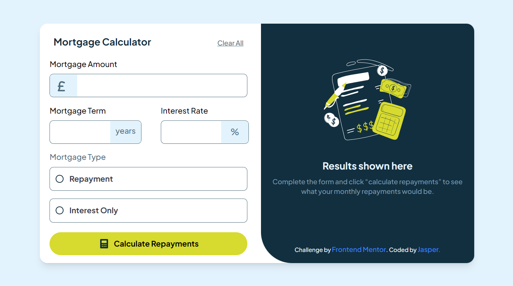

# Frontend Mentor - Mortgage repayment calculator solution

This is a solution to the [Mortgage repayment calculator challenge on Frontend Mentor](https://www.frontendmentor.io/challenges/mortgage-repayment-calculator-Galx1LXK73).

## Table of contents

- [Overview](#overview)
  - [The challenge](#the-challenge)
  - [Screenshot](#screenshot)
  - [Links](#links)
- [My process](#my-process)
  - [Built with](#built-with)
  - [What I learned](#what-i-learned)
  - [Useful resources](#useful-resources)
- [Author](#author)


## Overview

### The challenge

Users should be able to:

- Input mortgage information and see monthly repayment and total repayment amounts after submitting the form
- See form validation messages if any field is incomplete
- Complete the form only using their keyboard
- View the optimal layout for the interface depending on their device's screen size
- See hover and focus states for all interactive elements on the page

### Screenshot




### Links

- Solution URL: [Solution URL](https://github.com/JasperMunene/mortgage-calculator)
- Live Site URL: [Live Site URL](https://mortgagecalculator0.netlify.app/)

## My process

### Built with
- Semantic HTML5 markup
- Mobile-first workflow
- [Vite](-https://vitejs.dev/) - Frontend Tool
- [React](https://reactjs.org/) - JS library
- [Tailwind CSS](https://tailwindcss.com/) - A utility-first CSS framework


### What I learned
Through this project, I have gained valuable experience in state management,form validation and conditional rendering in React. These skills have enhanced my ability to create dynamic and responsive user interfaces, allowing for better user experiences and more maintainable code.

```js
const validateInputs = (inputs) => {
    const errors = {};

    const numericAmount = inputs.amount.replace(/,/g, '');
    const numericTerm = inputs.term;
    const numericInterest = inputs.interest;

    // Validate mortgage amount
    if (!inputs.amount) {
      errors.amount = 'This field is required';
    } else if (isNaN(numericAmount) || Number(numericAmount) <= 0) {
      errors.amount = 'Please enter a valid mortgage amount greater than zero';
    }

    // Validate mortgage term
    if (!inputs.term) {
      errors.term = 'This field is required';
    } else if (isNaN(numericTerm) || Number(numericTerm) <= 0) {
      errors.term = 'Please enter a valid mortgage term greater than zero';
    }

    // Validate interest rate
    if (!inputs.interest) {
      errors.interest = 'This field is required';
    } else if (isNaN(numericInterest) || Number(numericInterest) <= 0) {
      errors.interest = 'Please enter a valid interest rate greater than zero';
    }

    // Validate mortgage type
    if (!inputs.type) {
      errors.type = 'This field is required';
    }

    return errors;
  };
```

### Useful resources

- [Stack Overflow](https://stackoverflow.com/) - This helped me get solutions to the coding problems I had.
- [React Docs](https://react.dev/reference/react) - This helped me with knowing how to handle state management
- [Tailwind Docs](https://tailwindcss.com/docs/) - This helped me know how to style different components

## Author

- Website - [Jasper Munene](https://jaspermunene.netlify.app/)
- Frontend Mentor - [@JasperMunene](https://www.frontendmentor.io/profile/JasperMunene)
